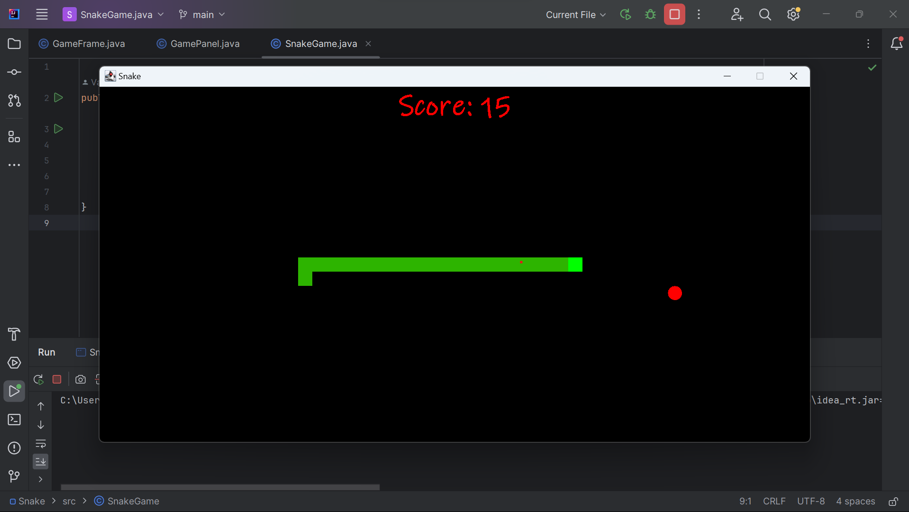

# SnakeGame_Java
Snake Game is a classic video game in which players control a snake, guiding it to consume food while avoiding collisions with itself and the boundaries of the play area. The snake continuously grows longer as it devours more food, intensifying the challenge. It's a test of reflexes and strategic planning, where players strive to achieve the highest score. Simple yet addictive, this Java-based game offers a captivating experience for gamers of all ages. Enjoy the thrill of maneuvering the snake through a dynamic, ever-expanding world in this enduring gaming classic.
# Screenshot

# Video
https://www.youtube.com/watch?v=jjJFmfHt1x  

